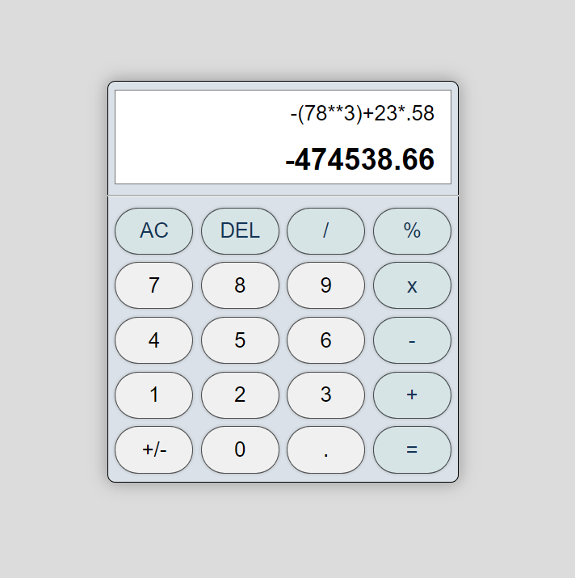

# Simple Calculator:

This is a simple calculator web application implemented using HTML, CSS, and JavaScript.

## Features:

Basic arithmetic operations: addition (+), subtraction (-), multiplication (*), and division (/),
Percentage calculation (%),
Clear all (AC) and delete (DEL) functionalities,
Toggle between positive and negative numbers (+/-),
Responsive design,
Error handling for invalid input,

## Technologies Used:

HTML

CSS

JavaScript

## Usage:

Simply open index.html in a web browser to use the calculator.

## Link:

Working Link: ([https://rahul6093.github.io/A-Simple-Calculator/]).

## Preview:

## License:

This project is licensed under the MIT License - see the LICENSE file for details.
